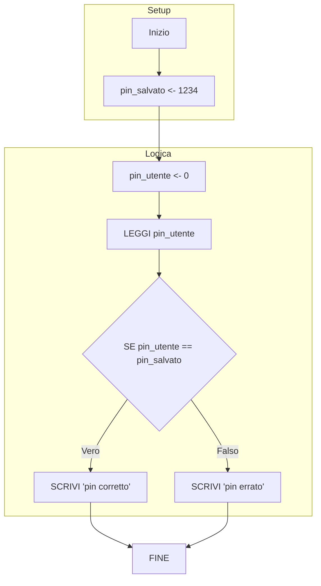
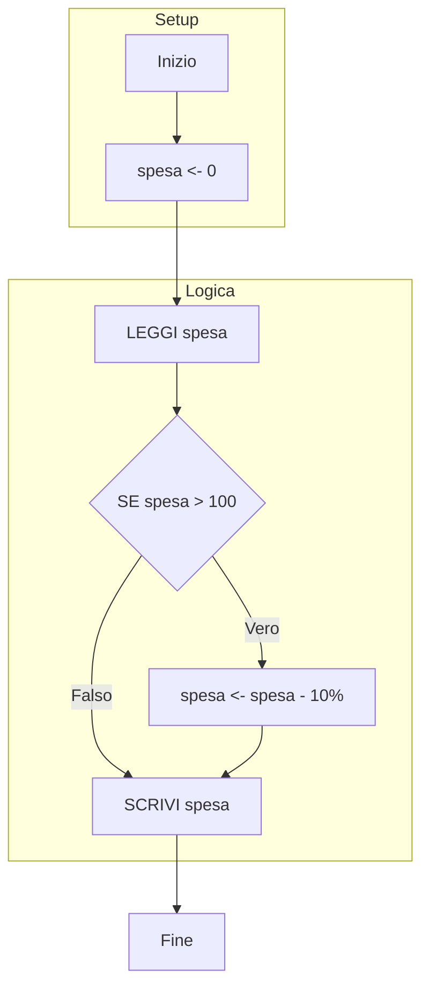
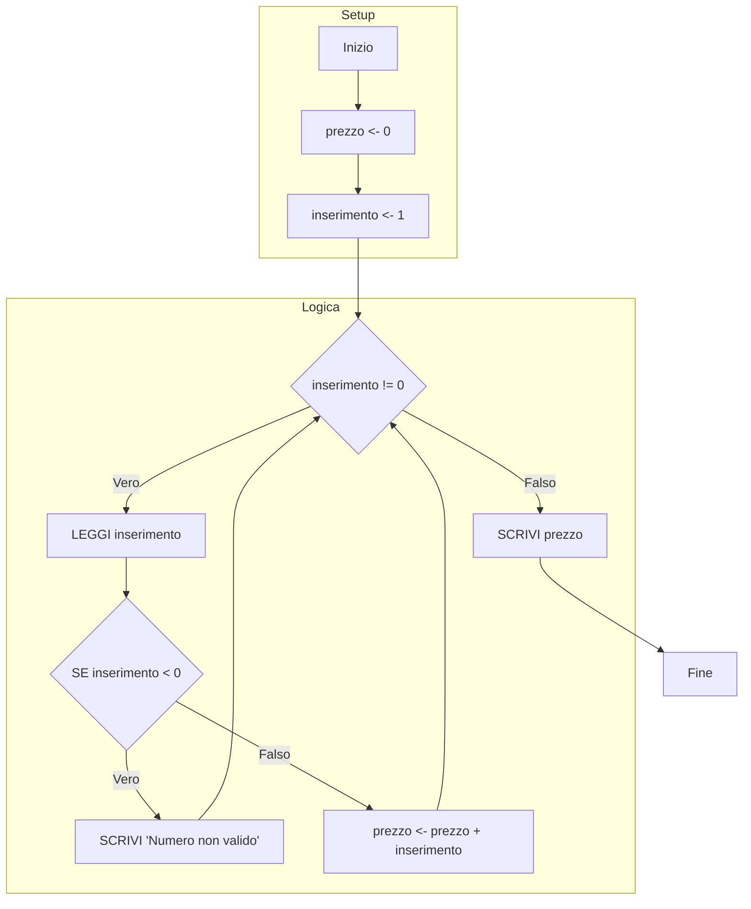
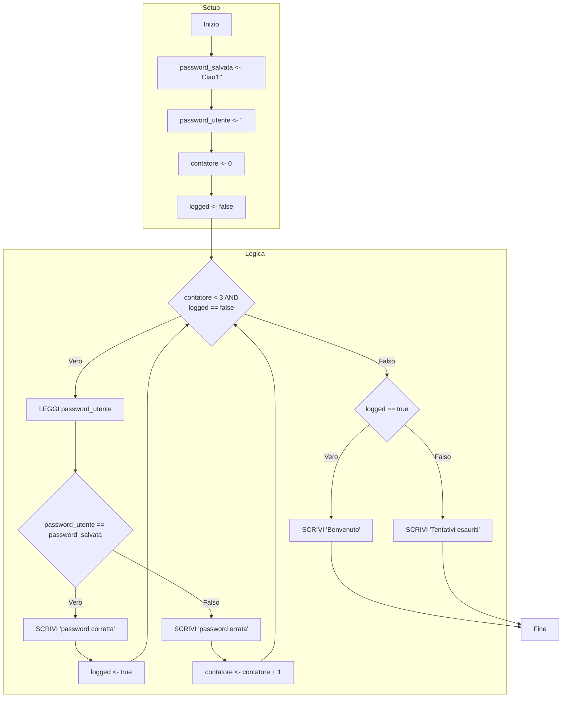
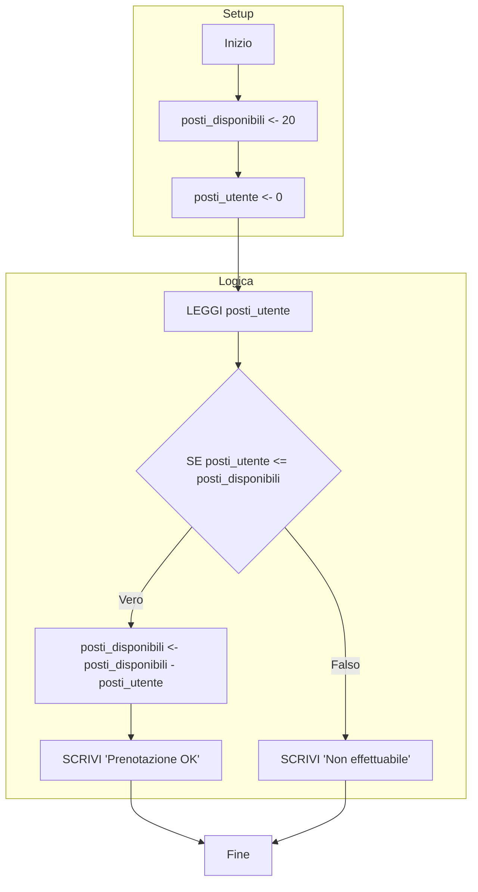
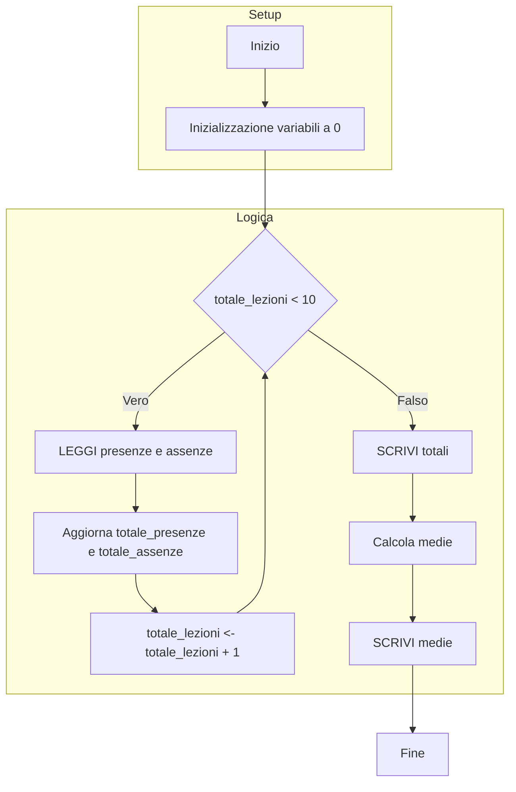

### Esercizio 1. Controllo accesso (badge / pin)
**Scenario:** L’utente inserisce un PIN; se è corretto entra, altrimenti no.

```python
INIZIO
	# Imposto il PIN segreto corretto
	pin_salvato <- 1234
	# Variabile per contenere quello che scriverà l'utente
	pin_utente <- 0
	
	# Chiedo all'utente di digitare il PIN
	LEGGI pin_utente
	
	# Confronto: se sono uguali entra, altrimenti errore
	SE pin_utente == pin_salvato
		SCRIVI "pin corretto"
		
	ALTRIMENTI
		SCRIVI "pin errato"
FINE
```



---

### Esercizio 2. Sconto su carrello
**Scenario:** Se il totale supera 100€, applica sconto 10%, altrimenti non fare niente.

```python
INIZIO
	spesa <- 0
	# Chiedo quanto ha speso l'utente
	LEGGI spesa
	
	# Se ha speso più di 100 euro, calcolo lo sconto
	SE spesa > 100
		# La nuova spesa è quella vecchia meno il 10%
		spesa <- spesa - (spesa * 0.10)
	
	# Stampo il prezzo finale (scontato o pieno)
	SCRIVI spesa
FINE
```



---

### Esercizio 3. Cassa automatica
**Scenario:** Inserisci prezzi finché non digiti 0; poi stampa totale.

```python
INIZIO
	# Totale da pagare
	prezzo <- 0
	# Variabile temporanea per l'inserimento (diversa da 0 per entrare nel ciclo)
	inserimento <- 1
	
	# Continuo a chiedere numeri finché l'utente non scrive 0
	MENTRE inserimento != 0
		LEGGI inserimento
		
		# Controllo di sicurezza: non accettiamo prezzi negativi
		SE inserimento < 0
			SCRIVI "inserisci numero maggiore di 0"
		ALTRIMENTI
			# Aggiungo il prezzo inserito al totale complessivo
			prezzo <- prezzo + inserimento
			
	# Alla fine stampo la somma totale
	SCRIVI prezzo
FINE
```



---

### Esercizio 4. Login con 3 tentativi
**Scenario:** Password corretta entro 3 tentativi.

```python
INIZIO
	password_salvata <- Ciao1!
	password_utente <- ""
	contatore <- 0
	logged <- false # "Bandiera" per ricordarsi se è entrato o no
	
	# Ripeto se: ho fatto meno di 3 tentativi E non sono ancora entrato
	MENTRE contatore < 3 E logged == false
		LEGGI password_utente
		
		SE password_utente == password_salvata
			SCRIVI "password corretta"
			logged <- true # Accesso riuscito, il ciclo finirà
		ALTRIMENTI
			SCRIVI "password errata"
			# Aumento il numero di tentativi usati
			contatore <- contatore + 1
			
	# Controllo finale: perché è uscito dal ciclo?
	SE logged == true
		SCRIVI "benvenuto"
	ALTRIMENTI
		SCRIVI "tentativi esauriti"
FINE
```



---

### Esercizio 5. Prenotazione posti
**Scenario:** Vuoi prenotare N posti; se disponibili, aggiorna disponibilità.

```python
INIZIO
	posti_disponibili <- 20
	posti_utente <- 0
	
	# Chiedo quanti posti vuole l'utente
	LEGGI posti_utente
	
	# Controllo se ce ne sono abbastanza
	SE posti_utente <= posti_disponibili
		# Tolgo i posti prenotati da quelli totali
		posti_disponibili <- posti_disponibili - posti_utente
		SCRIVI "Posti prenotati: ", posti_utente
	ALTRIMENTI
		SCRIVI "Prenotazione non effettuabile."
FINE
```



---

### Esercizio 6. Presenze in aula
**Scenario:** Per 10 lezioni inserisci presenti/assenti, calcola totali e medie.

```python
INIZIO
	# Contatore per sapere a che lezione siamo
	totale_lezioni <- 0
	
	# Variabili per i dati di ogni singola lezione
	presenze_giornaliere <- 0
	assenze_giornaliere <- 0
	
	# Totali complessivi (accumulatori)
	totale_presenze <- 0
	totale_assenze <- 0
	
	media_presenze <- 0
	media_assenze <- 0
	
	# Eseguo il blocco per 10 volte
	MENTRE totale_lezioni < 10
		LEGGI presenze_giornaliere
		# Aggiungo i presenti di oggi al mucchio totale
		totale_presenze <- totale_presenze + presenze_giornaliere
		
		LEGGI assenze_giornaliere 
		# Aggiungo gli assenti di oggi al mucchio totale
		totale_assenze <- totale_assenze + assenze_giornaliere
		
		# Importante: passo alla lezione successiva!
		totale_lezioni <- totale_lezioni + 1
	
	SCRIVI totale_presenze
	SCRIVI totale_assenze
	
	# Calcolo le medie (Totale / numero lezioni)
	media_presenze <- totale_presenze / 10
	SCRIVI media_presenze
	
	media_assenze <- totale_assenze / 10
	SCRIVI media_assenze
FINE
```


