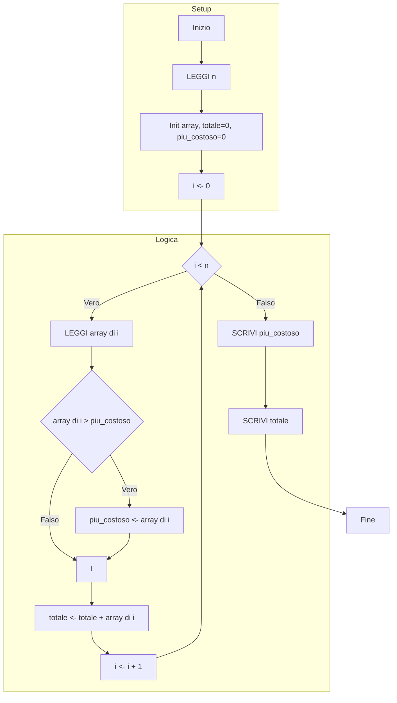
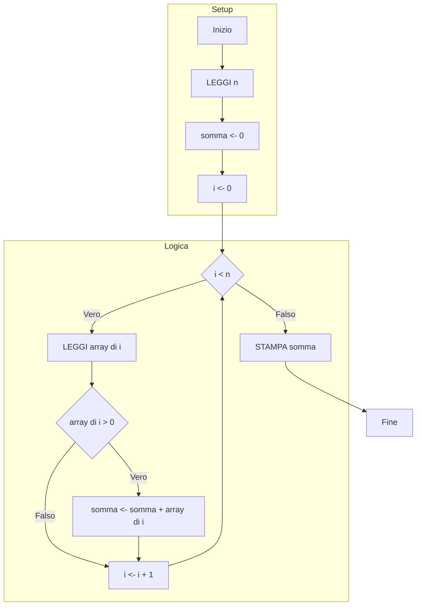
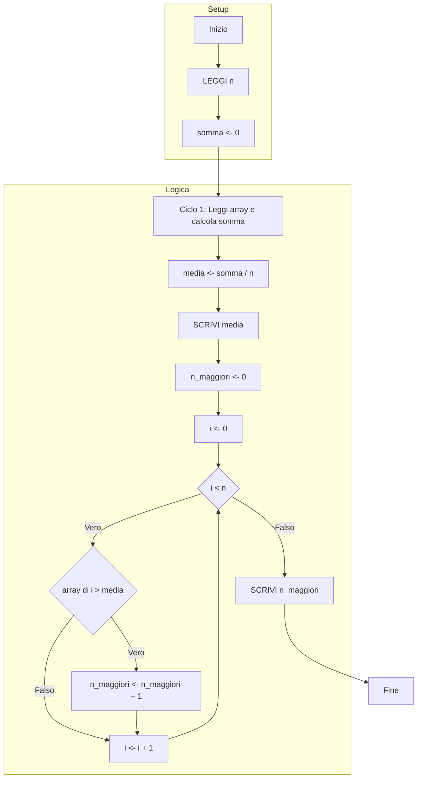
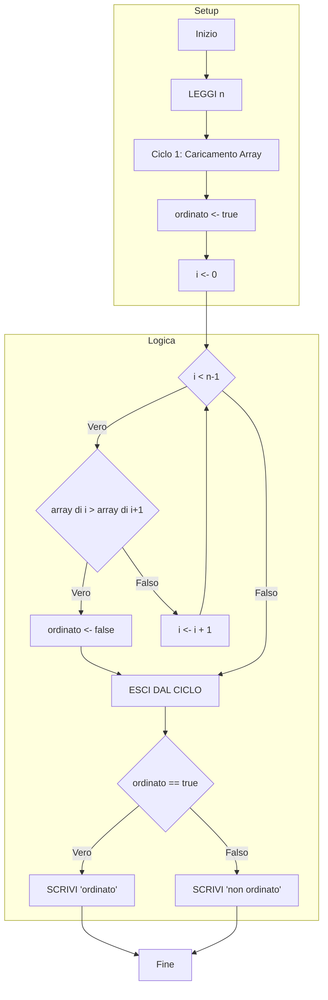
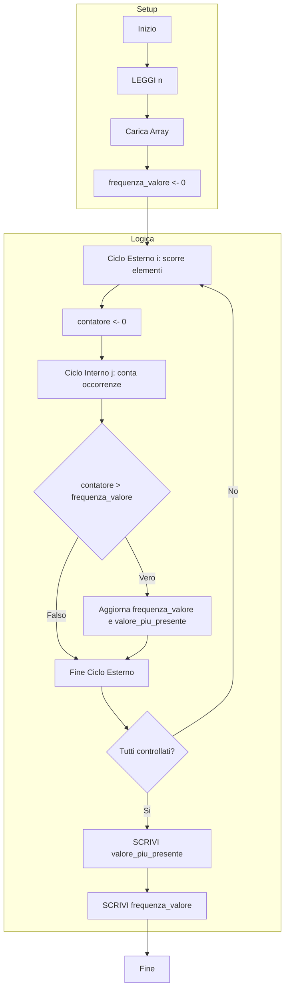
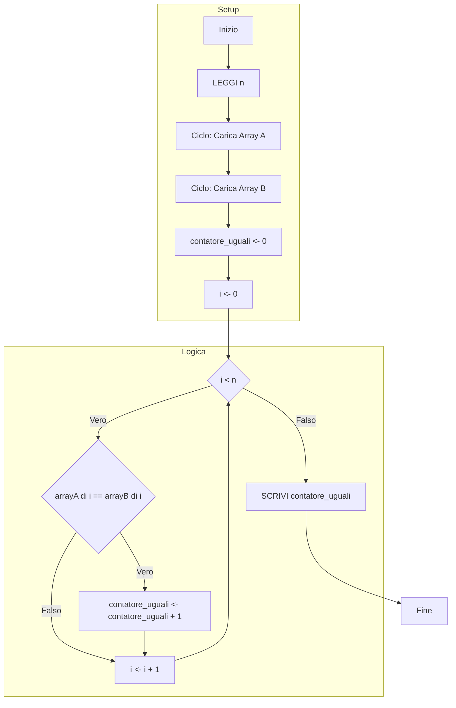

### Esercizio 1. Analisi lista spese
**Scenario:** Dati N importi, calcolare il totale e la spesa max nell'array.

```python
INIZIO
	n <- 0
	# Chiedo quanti scontrini devo analizzare
	LEGGI n
	# Creo una lista (array) vuota di dimensione n
	array <- [n]
	totale <- 0
	piu_costoso <- 0
	
	# Ciclo per leggere tutti i valori uno a uno
	PER i DA 0 A n-1
		LEGGI array [i]
		
		# Controllo se quello attuale è il più caro visto finora
		SE array[i] > piu_costoso
			piu_costoso <- array[i]
			
		# Aggiungo al totale generale
		totale <- totale + array[i]
	
	SCRIVI piu_costoso
	SCRIVI totale
FINE
```



### Esercizio 2. Somma dei valori positivi
**Scenario:** Dato un array di n numeri, calcolare somma solo dei positivi.

```python
INIZIO
	somma <- 0
	n <- 0
	LEGGI n
	# Creo l'array
	array <- [n]
	
	# Scorro tutto l'array dall'inizio alla fine
	PER i DA 0 A n-1
		 # Chiedo il numero
		 LEGGI array[i]
		 
		 # Se il numero è positivo (>0), lo sommo. Se è negativo lo ignoro.
		 SE array[i] > 0
			 somma <- somma + array[i]
			 
	STAMPA somma
FINE
```



---

### Esercizio 3. Conteggio valori sopra la media
**Scenario:** Calcola media array e conta quanti sono maggiori della media.

```python
INIZIO
	n <- 0
	LEGGI n
	array <- [n]
	somma <- 0
	
	# FASE 1: Caricamento e Somma
	PER i DA 0 A n-1
		LEGGI array[i]
		# Faccio subito la somma mentre leggo
		somma <- somma + array[i]
	
	# Calcolo la media matematica
	media <- somma / n
	SCRIVI media
	
	n_maggiori_media <- 0
	
	# FASE 2: Conteggio
	# Rileggo l'array per vedere chi supera la media
	PER i DA 0 A n-1
		SE array[i] > media
			n_maggiori_media <- n_maggiori_media + 1
			
	SCRIVI n_maggiori_media
FINE
```



---

### Esercizio 4. Verifica array ordinato
**Scenario:** Stabilire se l’array è ordinato in modo crescente.

```python
INIZIO
	n <- 0
	LEGGI n
	array <- [n]
	# Parto ottimista: assumo che sia ordinato (true)
	ordinato <- true
	
	# Carico tutti i numeri nell'array
	PER i da 0 A n-1
		LEGGI array[i]
	
	# Controllo l'ordinamento (fino al penultimo elemento)
	PER i DA 0 A n-2
		# Se trovo un numero più grande del suo successivo, l'ordine è rotto
		SE array[i] > array[i+1]
			ordinato <- false
			ESCI DAL CICLO # Inutile continuare a controllare
			
	SE ordinato
		SCRIVI "ordinato"
	ALTRIMENTI
		SCRIVI "non ordinato"
FINE
```



---

### Esercizio 5. Ricerca elemento più frequente
**Scenario:** Trova valore più frequente e numero di occorrenze.

```python
INIZIO
	n <- 0
	LEGGI n
	array <- [n]
	frequenza_valore <- 0 # Record di quante volte ho visto il vincitore
	
	# Carico l'array
	PER i DA 0 A n-1
		LEGGI array[i]
		
	valore_piu_presente <- array[0]
	
	# Ciclo Esterno: Prendo un numero alla volta (il "candidato")
	PER i DA 0 A n-1
	contatore <- 0
		# Ciclo Interno: Confronto il candidato con tutti gli altri
		PER j DA 0 A n-1
			SE array[i] == array[j]
				contatore <- contatore + 1
		
		# Se il candidato attuale ha battuto il record precedente
		SE contatore > frequenza_valore
			frequenza_valore <- contatore
			valore_piu_presente <- array[i]
			
	SCRIVI valore_piu_presente
	SCRIVI frequenza_valore
FINE
```



---

### Esercizio 6. Confronto due array
**Scenario:** Conta quante posizioni corrispondenti sono uguali tra Array A e B.

```python
INIZIO
	n <- 0
	LEGGI n
	arrayA <- [n]
	arrayB <- [n]
	contatore_uguali <- 0
	
	# Riempio il primo array
	PER i DA 0 A n-1
		LEGGI arrayA[i]
		
	# Riempio il secondo array
	PER i DA 0 A n-1
		LEGGI arrayB[i]
	
	# Confronto posizione per posizione (indice i)
	PER i DA 0 A n-1
		# Se l'elemento nella casella i di A è uguale a quello in B
		SE arrayA[i] == arrayB[i]
			contatore_uguali <- contatore_uguali + 1
	
	SCRIVI contatore_uguali
FINE
```


