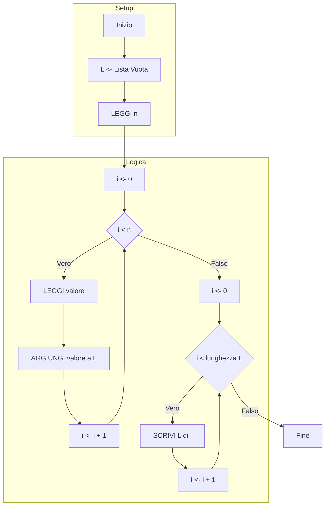
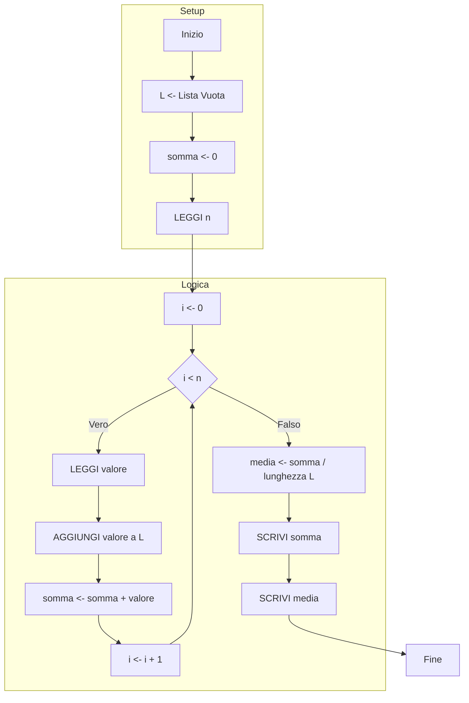
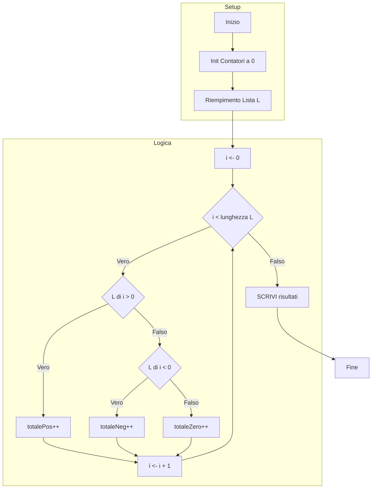
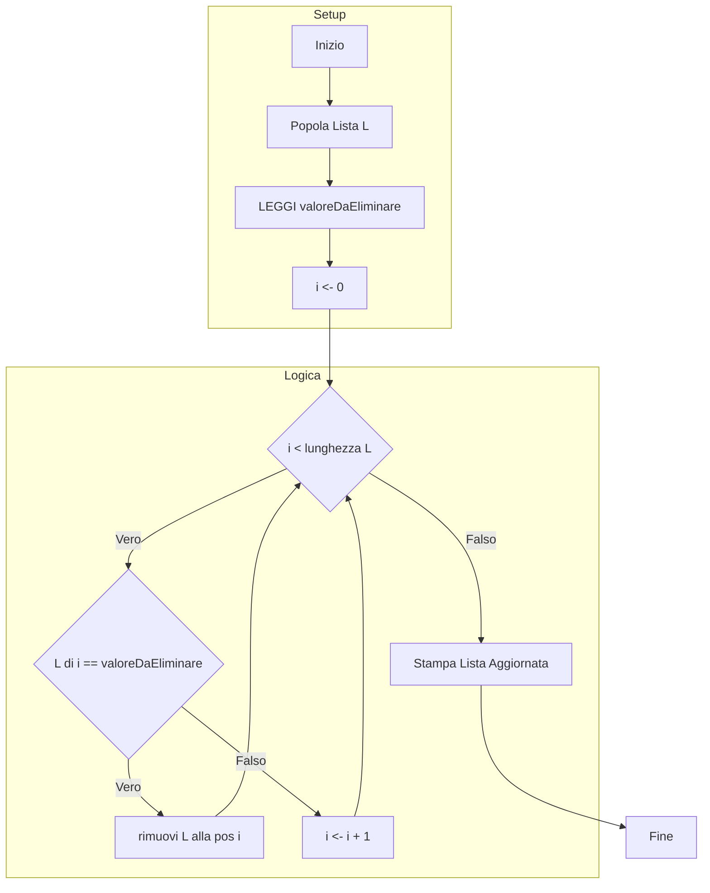
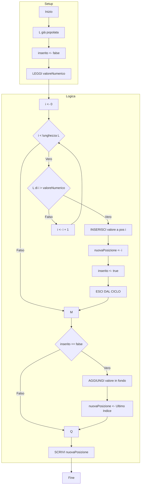
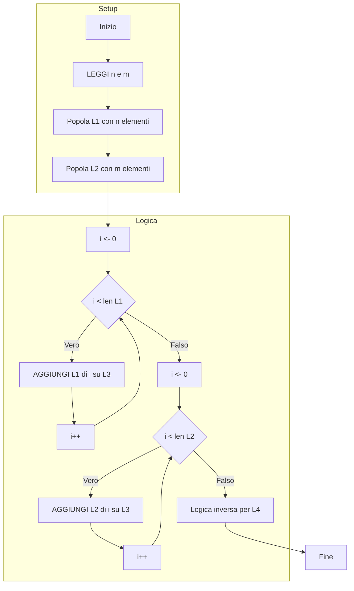

### Esercizio 1. Inserimento e Stampa
**Scenario:** Inserimento di n elementi all'interno di una lista chiamata L. Decido di stampare gli elementi nell'ordine di inserimento.

```python
 INIZIO
	# Creo una lista vuota pronta a ricevere dati
	L <- Lista Vuota
	
	n <- 0
	# Chiedo all'utente quanti numeri vuole inserire
	LEGGI n
	valore <- 0
	
	# CICLO DI INSERIMENTO
	# Ripeto per n volte
	PER i da 0 a n-1
		LEGGI valore
		# Aggiungo il valore in coda alla lista
		AGGIUNGI(L, valore)
		
	# CICLO DI STAMPA
	# Scorro la lista dalla posizione 0 fino all'ultima
	PER i da 0 a lunghezza(L)-1
		# Stampo l'elemento che si trova all'indice i
		SCRIVI L[i]
 FINE
```



---

### Esercizio 2. Somma e Media
**Scenario:** Leggi n numeri, aggiungili ad L, calcola la somma e la media.

```python
INIZIO
	L <- Lista Vuota
	
	somma <- 0
	media <- 0
	
	valore <- 0
	n <- 0
	LEGGI n
	
	# Mentre riempio la lista, calcolo già la somma per risparmiare tempo
	PER i da 0 a n-1
		LEGGI valore
		AGGIUNGI(L, valore)
		# Accumulo il valore nella variabile somma
		somma <- somma + valore
	
	# Calcolo la media matematica (Totale / Numero Elementi)
	media <- somma / lunghezza(L)
	
	# Stampo i risultati finali
	SCRIVI somma
	SCRIVI media
FINE
```



---

### Esercizio 3. Conteggio positivi, negativi e zeri
**Scenario:** Aggiungere n elementi ad una lista e definire quanti sono positivi, quanti negativi e quanti zeri.

```python
INIZIO
	L <- Lista Vuota
	
	# Preparo tre contatori distinti
	totalePos <- 0
	totaleNeg <- 0
	totaleZero <- 0
	
	valore <- 0
	n <- 0
	LEGGI n
	
	# Fase 1: Riempio la lista con tutti i numeri
	PER i da 0 a n-1
		LEGGI valore
		AGGIUNGI(L, valore)
		
	# Fase 2: Controllo ogni numero per vedere com'è
	PER i da 0 a lunghezza(L)-1
		# Se è maggiore di zero...
		SE L[i] > 0
			totalePos <- totalePos + 1
		# ...altrimenti, se è minore di zero...
		ALTRIMENTI SE L[i] < 0
			totaleNeg <- totaleNeg + 1
		# ...altrimenti deve per forza essere zero
		ALTRIMENTI
			totaleZero <- totaleZero + 1
			
	# Stampo il resoconto finale
	SCRIVI totalePos
	SCRIVI totaleNeg
	SCRIVI totaleZero
FINE
```



---

### Esercizio 4. Eliminazione occorrenze
**Scenario:** Popolate una lista. Leggete un valore x ed eliminate tutte le occorrenze di questo valore x dalla lista. Stampate la lista aggiornata.

```python
INIZIO
	L <- Lista Vuota
	
	valoreDaEliminare <- 0
	valoreLista <- 0
	
	n <- 0
	LEGGI n
	
	# Riempio la lista
	PER i da 0 a n-1
		LEGGI valoreLista
		AGGIUNGI(L, valoreLista)
	
	LEGGI valoreDaEliminare	
	
	# Resetto l'indice per scorrere la lista dall'inizio
	i <- 0
	
	# Uso MENTRE perché la lunghezza della lista cambierà se elimino cose.
	# Controllo fino alla fine della lista attuale.
	MENTRE i < lunghezza(L)
		SE L[i] == valoreDaEliminare
			# Rimuovo l'elemento. La lista si accorcia e gli elementi successivi scalano indietro.
			# NON incremento 'i' perché devo controllare il nuovo elemento che ha preso questo posto.
			rimuovi(L, i)
		ALTRIMENTI
			# Se il numero va bene, passo al prossimo indice
			i <- i + 1
	
	# Stampo la lista pulita
	PER i da 0 a lunghezza(L)-1
		SCRIVI L[i]
FINE
```



---

### Esercizio 5. Inserimento ordinato
**Scenario:** Inserire un nuovo valore in una lista già ordinata mantenendo l'ordine e stampare l'indice di inserimento.

```python
INIZIO
	# Immaginiamo che L sia già piena e ordinata (es: 2, 5, 8)
	L <- Lista Popolata In Ordine Crescente
	
	nuovaPosizione <- 0
	# Variabile 'bandiera' per sapere se abbiamo trovato il posto
	inserito <- false
	
	valoreNumerico <- 0
	LEGGI valoreNumerico
	
	# Scorro la lista per cercare il primo numero più grande del mio
	PER i da 0 a lunghezza(L)-1
		SE L[i] > valoreNumerico
			# Trovato! Inserisco il mio numero PRIMA di quello più grande
			INSERISCI(L, valoreNumerico, i)
			nuovaPosizione <- i
			# Mi segno che l'ho inserito
			inserito <- true
			# Esco subito dal ciclo, ho finito
			esci dal ciclo
			
	# Se ho finito il ciclo e non l'ho ancora inserito, vuol dire che
	# il mio numero è il più grande di tutti.
	SE inserito == false
		AGGIUNGI(L, valoreNumerico) # Lo metto in fondo
		nuovaPosizione <- lunghezza(L)-1
	
	SCRIVI "Posizione del numero inserito: ", nuovaPosizione
FINE
```



---

### Esercizio 6. Concatenazione Liste
**Scenario:** Unione di 2 liste. Dati gli elementi di L1 ed L2, voglio popolare L3 con tutti gli elementi.

```python
INIZIO
	L1 <- Lista Vuota
	L2 <- Lista Vuota
	L3 <- Lista Vuota
	L4 <- Lista Vuota
	
	valore <- 0
	n <- 0
	m <- 0
	
	# RIEMPIMENTO LISTA 1
	LEGGI n
	PER i da 0 a n-1
		LEGGI valore
		AGGIUNGI(L1, valore)
		
	# RIEMPIMENTO LISTA 2
	LEGGI m
	PER i da 0 a m-1
		LEGGI valore
		AGGIUNGI(L2, valore)
		
	# COSTRUZIONE LISTA 3 (L1 + L2)
	# Copio prima tutti gli elementi di L1
	PER i da 0 a lunghezza(L1)-1
		AGGIUNGI(L3, L1[i])
		
	# Copio poi tutti gli elementi di L2
	PER i da 0 a lunghezza(L2)-1
		AGGIUNGI(L3, L2[i])
		
	# COSTRUZIONE LISTA 4 (L2 + L1) - Esempio inverso
	# Copio prima L2
	PER i da 0 a lunghezza(L2)-1
		AGGIUNGI(L4, L2[i])
	
	# Poi copio L1
	PER i da 0 a lunghezza(L1)-1
		AGGIUNGI(L4, L1[i])
FINE
```


