# Esercizi Base

### Esercizio 1. Controllo accesso (badge / pin)
**Scenario:** L’utente inserisce un PIN; se è corretto entra, altrimenti no.

```python
INIZIO
	# Imposto il PIN segreto corretto
	pin_salvato <- 1234
	# Variabile per contenere quello che scriverà l'utente
	pin_utente <- 0
	
	# Chiedo all'utente di digitare il PIN
	LEGGI pin_utente
	
	# Confronto: se sono uguali entra, altrimenti errore
	SE pin_utente == pin_salvato
		SCRIVI "pin corretto"
		
	ALTRIMENTI
		SCRIVI "pin errato"
FINE
```

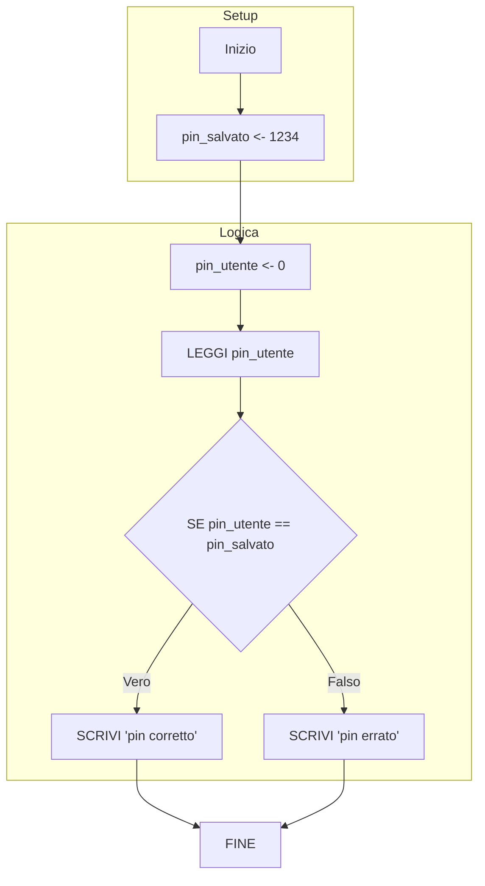

---

### Esercizio 2. Sconto su carrello
**Scenario:** Se il totale supera 100€, applica sconto 10%, altrimenti non fare niente.

```python
INIZIO
	spesa <- 0
	# Chiedo quanto ha speso l'utente
	LEGGI spesa
	
	# Se ha speso più di 100 euro, calcolo lo sconto
	SE spesa > 100
		# La nuova spesa è quella vecchia meno il 10%
		spesa <- spesa - (spesa * 0.10)
	
	# Stampo il prezzo finale (scontato o pieno)
	SCRIVI spesa
FINE
```

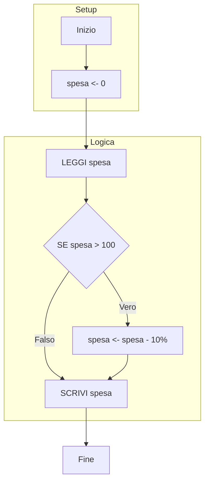

---

### Esercizio 3. Cassa automatica
**Scenario:** Inserisci prezzi finché non digiti 0; poi stampa totale.

```python
INIZIO
	# Totale da pagare
	prezzo <- 0
	# Variabile temporanea per l'inserimento (diversa da 0 per entrare nel ciclo)
	inserimento <- 1
	
	# Continuo a chiedere numeri finché l'utente non scrive 0
	MENTRE inserimento != 0
		LEGGI inserimento
		
		# Controllo di sicurezza: non accettiamo prezzi negativi
		SE inserimento < 0
			SCRIVI "inserisci numero maggiore di 0"
		ALTRIMENTI
			# Aggiungo il prezzo inserito al totale complessivo
			prezzo <- prezzo + inserimento
			
	# Alla fine stampo la somma totale
	SCRIVI prezzo
FINE
```

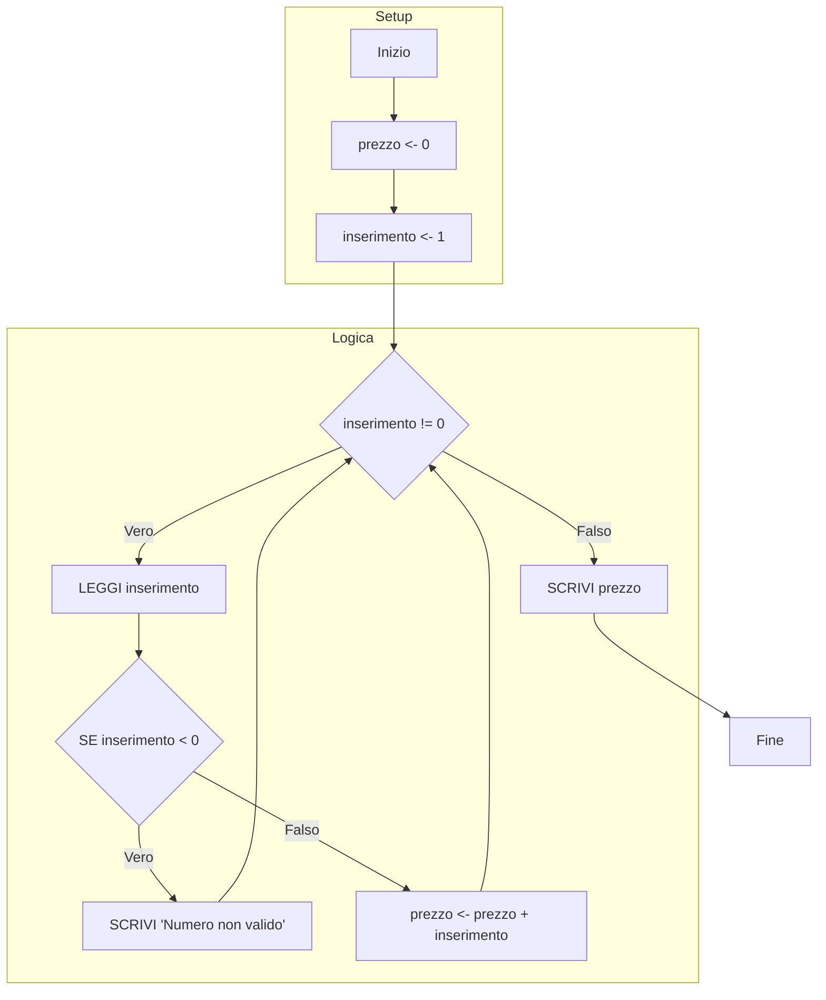

---

### Esercizio 4. Login con 3 tentativi
**Scenario:** Password corretta entro 3 tentativi.

```python
INIZIO
	password_salvata <- Ciao1!
	password_utente <- ""
	contatore <- 0
	logged <- false # "Bandiera" per ricordarsi se è entrato o no
	
	# Ripeto se: ho fatto meno di 3 tentativi E non sono ancora entrato
	MENTRE contatore < 3 E logged == false
		LEGGI password_utente
		
		SE password_utente == password_salvata
			SCRIVI "password corretta"
			logged <- true # Accesso riuscito, il ciclo finirà
		ALTRIMENTI
			SCRIVI "password errata"
			# Aumento il numero di tentativi usati
			contatore <- contatore + 1
			
	# Controllo finale: perché è uscito dal ciclo?
	SE logged == true
		SCRIVI "benvenuto"
	ALTRIMENTI
		SCRIVI "tentativi esauriti"
FINE
```

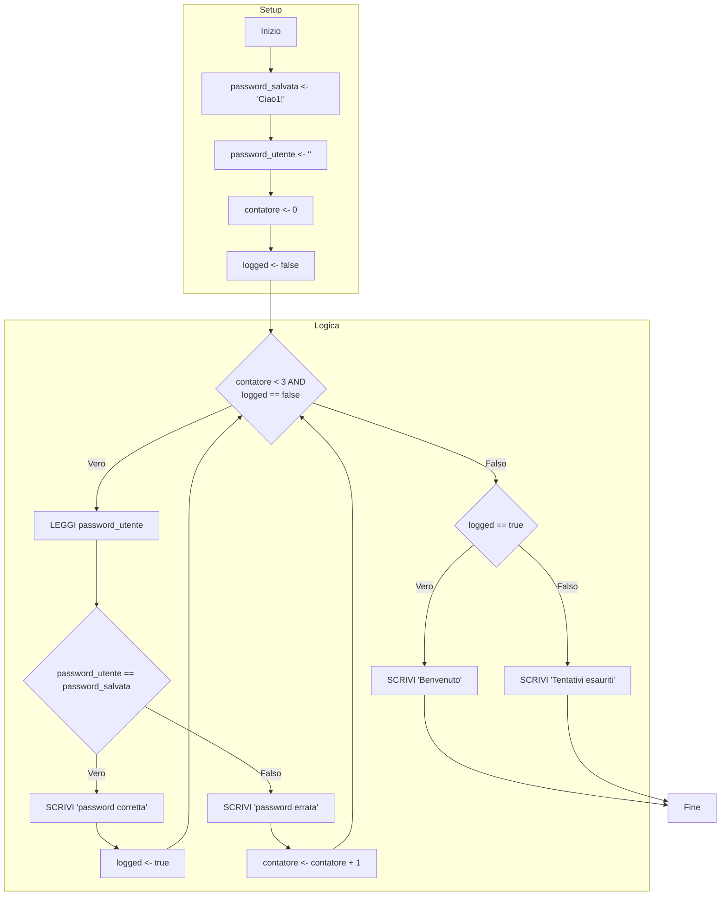

---

### Esercizio 5. Prenotazione posti
**Scenario:** Vuoi prenotare N posti; se disponibili, aggiorna disponibilità.

```python
INIZIO
	posti_disponibili <- 20
	posti_utente <- 0
	
	# Chiedo quanti posti vuole l'utente
	LEGGI posti_utente
	
	# Controllo se ce ne sono abbastanza
	SE posti_utente <= posti_disponibili
		# Tolgo i posti prenotati da quelli totali
		posti_disponibili <- posti_disponibili - posti_utente
		SCRIVI "Posti prenotati: ", posti_utente
	ALTRIMENTI
		SCRIVI "Prenotazione non effettuabile."
FINE
```

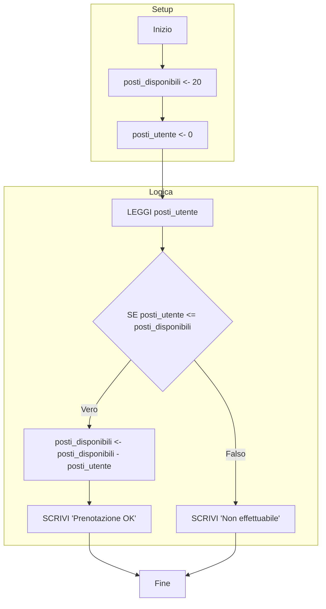

---

### Esercizio 6. Presenze in aula
**Scenario:** Per 10 lezioni inserisci presenti/assenti, calcola totali e medie.

```python
INIZIO
	# Contatore per sapere a che lezione siamo
	totale_lezioni <- 0
	
	# Variabili per i dati di ogni singola lezione
	presenze_giornaliere <- 0
	assenze_giornaliere <- 0
	
	# Totali complessivi (accumulatori)
	totale_presenze <- 0
	totale_assenze <- 0
	
	media_presenze <- 0
	media_assenze <- 0
	
	# Eseguo il blocco per 10 volte
	MENTRE totale_lezioni < 10
		LEGGI presenze_giornaliere
		# Aggiungo i presenti di oggi al mucchio totale
		totale_presenze <- totale_presenze + presenze_giornaliere
		
		LEGGI assenze_giornaliere 
		# Aggiungo gli assenti di oggi al mucchio totale
		totale_assenze <- totale_assenze + assenze_giornaliere
		
		# Importante: passo alla lezione successiva!
		totale_lezioni <- totale_lezioni + 1
	
	SCRIVI totale_presenze
	SCRIVI totale_assenze
	
	# Calcolo le medie (Totale / numero lezioni)
	media_presenze <- totale_presenze / 10
	SCRIVI media_presenze
	
	media_assenze <- totale_assenze / 10
	SCRIVI media_assenze
FINE
```

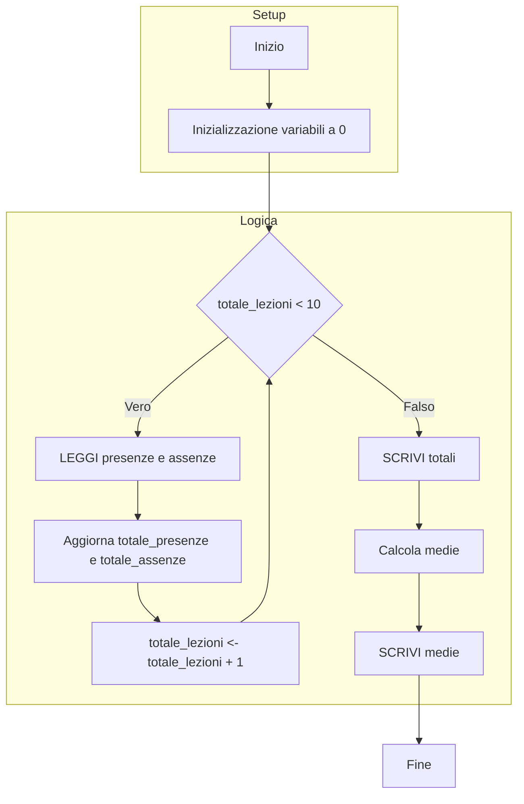

---

### Esercizio 7. Analisi lista spese
**Scenario:** Dati N importi, calcolare il totale e la spesa max nell'array.

```python
INIZIO
	n <- 0
	# Chiedo quanti scontrini devo analizzare
	LEGGI n
	# Creo una lista (array) vuota di dimensione n
	array <- [n]
	totale <- 0
	piu_costoso <- 0
	
	# Ciclo per leggere tutti i valori uno a uno
	PER i DA 0 A n-1
		LEGGI array [i]
		
		# Controllo se quello attuale è il più caro visto finora
		SE array[i] > piu_costoso
			piu_costoso <- array[i]
			
		# Aggiungo al totale generale
		totale <- totale + array[i]
	
	SCRIVI piu_costoso
	SCRIVI totale
FINE
```

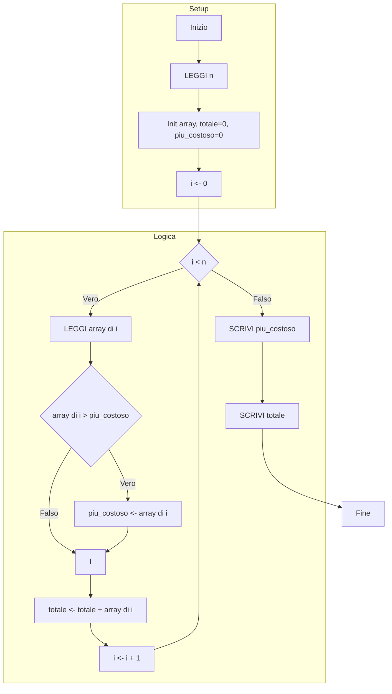

---

# Esercizi PDF

### Esercizio 1 PDF. Somma dei valori positivi
**Scenario:** Dato un array di n numeri, calcolare somma solo dei positivi.

```python
INIZIO
	somma <- 0
	n <- 0
	LEGGI n
	# Creo l'array
	array <- [n]
	
	# Scorro tutto l'array dall'inizio alla fine
	PER i DA 0 A n-1
		 # Chiedo il numero
		 LEGGI array[i]
		 
		 # Se il numero è positivo (>0), lo sommo. Se è negativo lo ignoro.
		 SE array[i] > 0
			 somma <- somma + array[i]
			 
	STAMPA somma
FINE
```

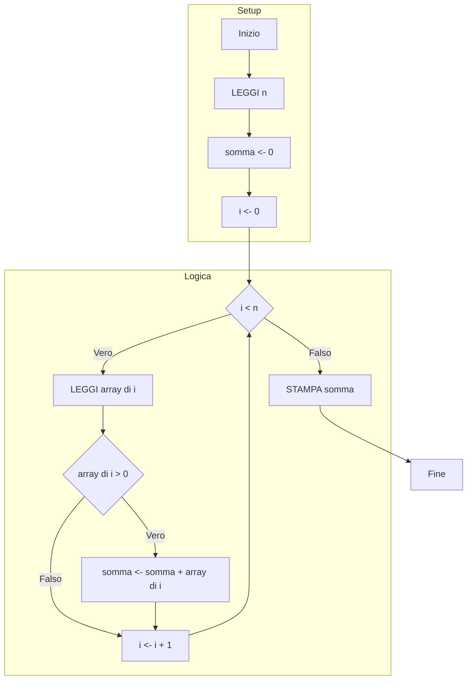

---

### Esercizio 2 PDF. Conteggio valori sopra la media
**Scenario:** Calcola media array e conta quanti sono maggiori della media.

```python
INIZIO
	n <- 0
	LEGGI n
	array <- [n]
	somma <- 0
	
	# FASE 1: Caricamento e Somma
	PER i DA 0 A n-1
		LEGGI array[i]
		# Faccio subito la somma mentre leggo
		somma <- somma + array[i]
	
	# Calcolo la media matematica
	media <- somma / n
	SCRIVI media
	
	n_maggiori_media <- 0
	
	# FASE 2: Conteggio
	# Rileggo l'array per vedere chi supera la media
	PER i DA 0 A n-1
		SE array[i] > media
			n_maggiori_media <- n_maggiori_media + 1
			
	SCRIVI n_maggiori_media
FINE
```

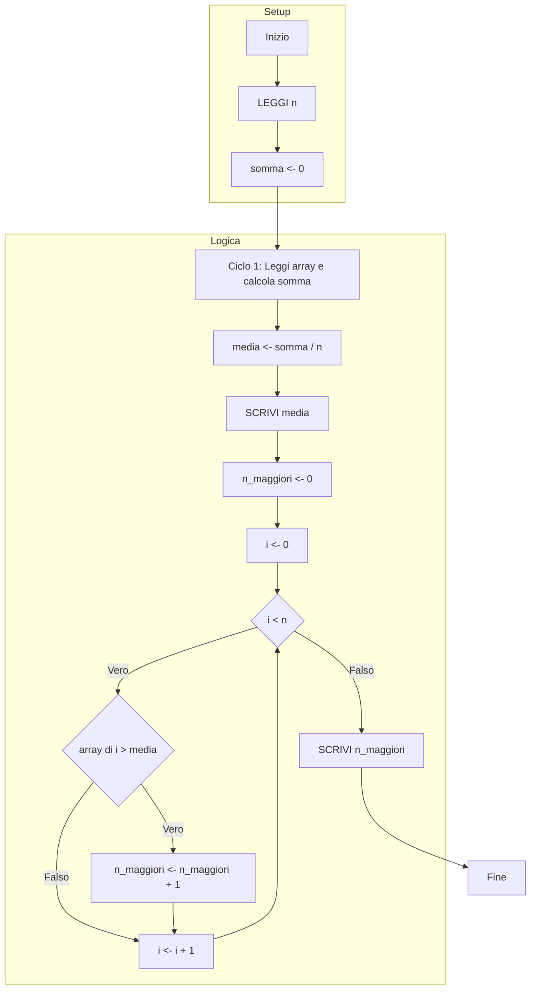

---

### Esercizio 3 PDF. Verifica array ordinato
**Scenario:** Stabilire se l’array è ordinato in modo crescente.

```python
INIZIO
	n <- 0
	LEGGI n
	array <- [n]
	# Parto ottimista: assumo che sia ordinato (true)
	ordinato <- true
	
	# Carico tutti i numeri nell'array
	PER i da 0 A n-1
		LEGGI array[i]
	
	# Controllo l'ordinamento (fino al penultimo elemento)
	PER i DA 0 A n-2
		# Se trovo un numero più grande del suo successivo, l'ordine è rotto
		SE array[i] > array[i+1]
			ordinato <- false
			ESCI DAL CICLO # Inutile continuare a controllare
			
	SE ordinato
		SCRIVI "ordinato"
	ALTRIMENTI
		SCRIVI "non ordinato"
FINE
```

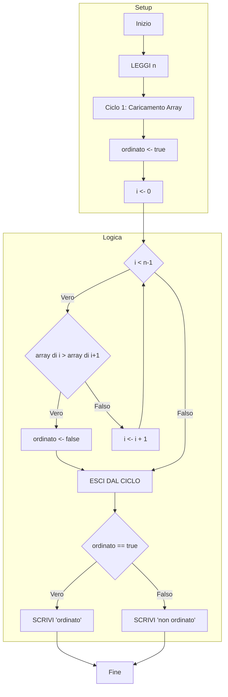

---

### Esercizio 4 PDF. Ricerca elemento più frequente
**Scenario:** Trova valore più frequente e numero di occorrenze.

```python
INIZIO
	n <- 0
	LEGGI n
	array <- [n]
	frequenza_valore <- 0 # Record di quante volte ho visto il vincitore
	
	# Carico l'array
	PER i DA 0 A n-1
		LEGGI array[i]
		
	valore_piu_presente <- array[0]
	
	# Ciclo Esterno: Prendo un numero alla volta (il "candidato")
	PER i DA 0 A n-1
	contatore <- 0
		# Ciclo Interno: Confronto il candidato con tutti gli altri
		PER j DA 0 A n-1
			SE array[i] == array[j]
				contatore <- contatore + 1
		
		# Se il candidato attuale ha battuto il record precedente
		SE contatore > frequenza_valore
			frequenza_valore <- contatore
			valore_piu_presente <- array[i]
			
	SCRIVI valore_piu_presente
	SCRIVI frequenza_valore
FINE
```

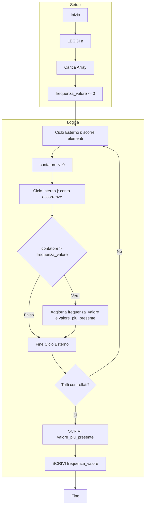

---

### Esercizio 5 PDF. Confronto due array
**Scenario:** Conta quante posizioni corrispondenti sono uguali tra Array A e B.

```python
INIZIO
	n <- 0
	LEGGI n
	arrayA <- [n]
	arrayB <- [n]
	contatore_uguali <- 0
	
	# Riempio il primo array
	PER i DA 0 A n-1
		LEGGI arrayA[i]
		
	# Riempio il secondo array
	PER i DA 0 A n-1
		LEGGI arrayB[i]
	
	# Confronto posizione per posizione (indice i)
	PER i DA 0 A n-1
		# Se l'elemento nella casella i di A è uguale a quello in B
		SE arrayA[i] == arrayB[i]
			contatore_uguali <- contatore_uguali + 1
	
	SCRIVI contatore_uguali
FINE
```

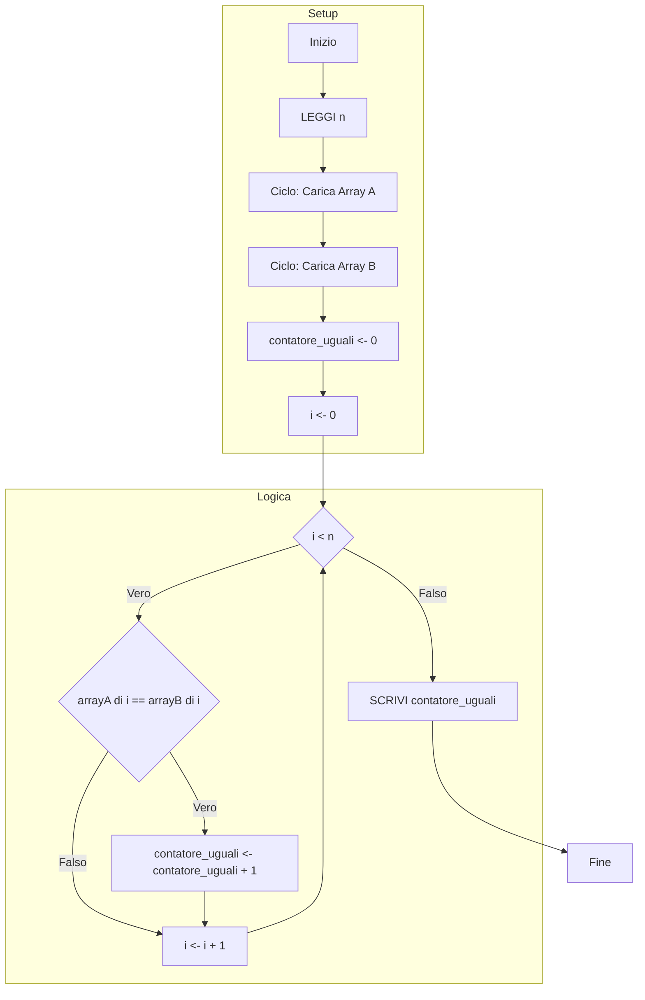